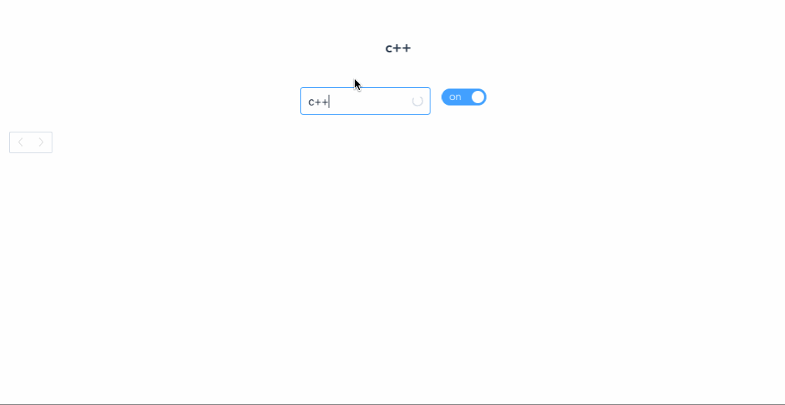

# douban_book

> A Vue.js project with douban_book_api

[douban_book_api](https://developers.douban.com/wiki/?title=book_v2)

[element](https://github.com/ElemeFE/element)



## Build Setup

``` bash
# install dependencies
npm install

# serve with hot reload at localhost:8080
npm run dev

# build for production with minification
npm run build

# run unit tests
npm run unit

# run e2e tests
npm run e2e

# run all tests
npm test
```

For detailed explanation on how things work, checkout the [guide](http://vuejs-templates.github.io/webpack/) and [docs for vue-loader](http://vuejs.github.io/vue-loader).
